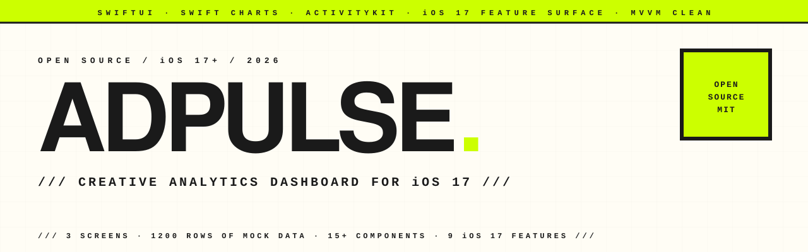

<p align="center">
  <picture>
    <source media="(prefers-color-scheme: dark)" srcset="assets/hero-banner-dark.svg" />
    
  </picture>
</p>

<p align="center">
  
  
  
  
</p>

<p align="center">
  <em>AdPulse is an open-source iOS 17+ analytics dashboard for monitoring ad-creative performance — Meta Ads, ad spend, ROAS, conversions, anomalies. Built as a reference implementation of the modern iOS feature surface: <code>@Observable</code>, Symbol Effects, Sensory Feedback, Live Activities, interactive Swift Charts, presentation detents, SwiftData persistence, and Live Activity widgets.</em>
</p>

---

### `/// WHAT IT DOES`

A native dashboard for a creative-economy brand to monitor ad performance across products, creators, content types, and campaigns. Mock data ships in the repo: **1,200 campaign records**, **5 months**, **7 products**, **10 creators**, **5 content types**, **8 marketing angles**. Swap the CSV for a real backend and you have a working production surface.

---

### `/// FEATURES`

| | |
|---|---|
| **Adaptive layout** | `NavigationSplitView` on iPad, `TabView` on iPhone — same code, two surfaces |
| **iOS 17 `@Observable` ViewModel** | No `ObservableObject` / `@Published` boilerplate; computed `filteredCreatives` recomputes on filter mutation |
| **Symbol Effects** | `.bounce`, `.pulse`, `.wiggle` on KPI tiles, status indicators, refresh controls |
| **Sensory Feedback** | `.sensoryFeedback(.selection / .impact / .success)` on every meaningful interaction |
| **Interactive Swift Charts** | ROAS-by-Month and Budget-by-Product with `chartXSelection` / `chartYSelection` |
| **Live Activities + Dynamic Island** | `ActivityKit` driver + Widget Extension; the filtered cohort streams to the Lock Screen and the Dynamic Island |
| **SwiftData persistence** | Favorites and search history survive restarts (`@Model` + `@Query`) |
| **Anomaly detection** | Z-score on ROAS against the cohort mean — surfaces winners and losers in the Overview |
| **Search suggestions** | iOS 17 `.searchable` with persisted recent-search completion |
| **Presentation Detents** | Sheets resize to their content (`.presentationDetents([.medium, .large])`) |
| **Accessibility** | Combined elements, VoiceOver labels + values on every card and chart, Reduce Motion respected |
| **Settings** | Appearance picker (System / Light / Dark), sensory-feedback toggle, Live Activity control, anomaly threshold slider, data cleanup |

---

### `/// SCREENS`

**Overview** — six headline KPIs · ROAS / Budget charts with selection · Anomalies surfaced when threshold exceeded · Top 5 creatives by ROAS · Top 5 creators by conversions · pull-to-refresh + haptics · error banner when data load fails.

**Creatives List** — smart search backed by SwiftData history · filter by Product / Month / Status / Type · sort six ways · context menus with preview · adaptive sheets for quick view.

**Creative Detail** — eight selectable KPIs with sensory feedback · flow-layout tag stack · star to favorite (persists) · quick actions in toolbar.

**Settings** — appearance, haptics, Live Activity tracking, anomaly threshold, data cleanup, repo & portfolio links.

**Onboarding** — three-step intro on first launch.

---

### `/// ARCHITECTURE`

```
MVVM Clean
├── Models/             Creative, FilterState, FavoriteCreative (@Model), SearchHistoryItem (@Model)
├── ViewModels/         DashboardViewModel — computed KPIs, filtered cohort, anomalies
├── Views/
│   ├── Screens/        OverviewView, CreativesListView, CreativeDetailView, SettingsView, OnboardingView
│   └── Components/     KPICard, RankingRow, StatusBadge, CreativeRow, AnomalyRow, ErrorBanner, …
├── Services/           CSVParser, LiveActivityManager, AnomalyDetector
├── Shared/             CampaignActivityAttributes (cross-target — App + Widget)
├── Widgets/            AdPulseWidgetBundle, CampaignLiveActivity (Widget Extension target)
├── Tests/AdPulseTests/ CSVParser, DashboardViewModel, FilterState
├── Theme/              brutalist palette + design tokens
└── Resources/Assets.xcassets/  AppIcon.appiconset (1024×1024 universal)
```

Reactive surface is pure `@Observable` — every mutation re-renders dependents automatically. Live Activity state is owned by a singleton `LiveActivityManager`. The Widget Extension imports `Shared/CampaignActivityAttributes.swift` as a member of both targets.

---

### `/// SETUP`

```bash
git clone https://github.com/hatimhtm/adpulse-ios.git
cd adpulse-ios
# Open the folder in Xcode 15+, target an iOS 17.0+ simulator or device.
```

Two extension targets need to be created in Xcode (one-time):

- **Widget Extension** — see [`Widgets/SETUP.md`](Widgets/SETUP.md). Hosts `CampaignLiveActivity` and the Lock Screen view.
- **Unit Test bundle** — see [`Tests/SETUP.md`](Tests/SETUP.md). Add the test files; run `⌘U`.

Mock data lives in `AdPulse-Data.csv` — 1,200 rows for the fictional **Vital** wellness brand. Column headers are in French (the original brief was for a French-speaking team); the data is parsed by `Services/CSVParser.swift`. Swap the CSV (or replace the parser with a network fetch) to wire up a real backend.

---

### `/// CONTRIBUTING`

Pull requests welcome. The code follows Swift API design guidelines, tabs four spaces wide, and prefers `@Observable` over `ObservableObject` everywhere. Run the tests before opening a PR (`⌘U`).

---

### `/// TECH`

`SwiftUI` · `Swift Charts` · `SwiftData` · `ActivityKit` · `Observation` (`@Observable`) · `WidgetKit` · `MVVM Clean`

---

### `/// LICENSE`

MIT — see [LICENSE](LICENSE). Use it, fork it, ship something with it.

---

<p align="center">
  <a href="https://hatimelhassak.is-a.dev"></a>
  <a href="https://cal.com/hatimelhassak/engineering-discovery"></a>
  <a href="https://www.linkedin.com/in/hatim-elhassak/"></a>
  <a href="mailto:hatimelhassak.official@gmail.com"></a>
</p>

<p align="center">
  <code>///&nbsp;&nbsp;OPEN FOR NEW WORK&nbsp;&nbsp;///&nbsp;&nbsp;CONTRACT &amp; FREELANCE&nbsp;&nbsp;///&nbsp;&nbsp;REMOTE WORLDWIDE&nbsp;&nbsp;///</code>
</p>
